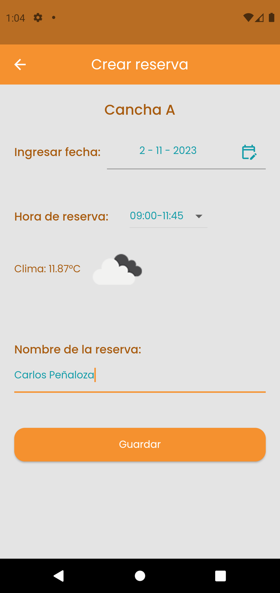

# tenis_club

A new Flutter project.

- This app is intended for tennis court administrators to handle reservation requests.
- I used [flutter_bloc](https://pub.dev/packages/flutter_bloc) package for State Management.
- I used clean architecture


</br>
</br>

## version of flutter and Dart
 - Flutter 3.13.9 
 - Dart 3.1.5 
 - DevTools 2.25.0

## Packages used

 - cupertino_icons: ^1.0.6
 - google_fonts: ^6.1.0
 - sqflite: ^2.3.0
 - path: ^1.8.3
 - flutter_spinkit: ^5.2.0
 - http: ^1.1.0
 - flutter_bloc: ^8.1.3

## Screenshots

<br>
<p align="center">




  
</p>

## How to use

To clone and run this application, you'll need [Git](https://git-scm.com/downloads) and [Flutter](https://flutter.dev/docs/get-started/install) installed on your computer. From your command line:

```
# Clone this repository
$ git clone https://github.com/alejogrande/tenis_club_flutter

# Install dependencies
$ flutter packages get

# Run the app
$ flutter run
```
